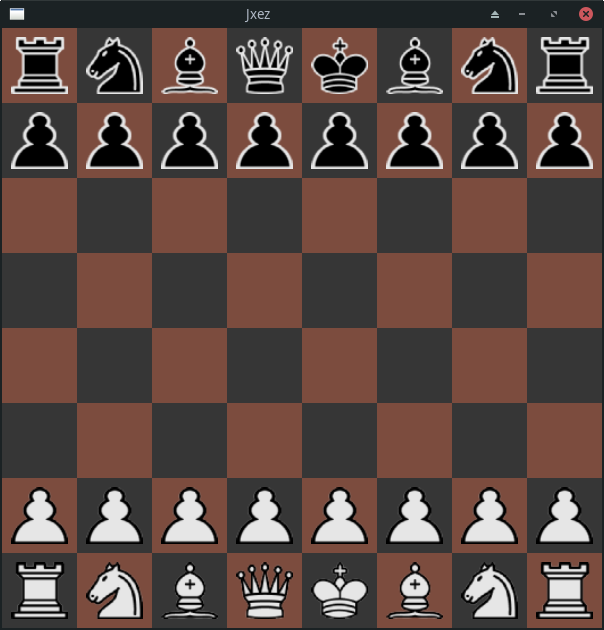

# Jxez

A virtual chessboard to analyze games and positions.



## Requirements

- Java 11
- Maven 3.x

The easiest way to install both on Ubuntu is with [SDKMAN](https://sdkman.io):

```bash
curl -s "https://get.sdkman.io" | bash
source "$HOME/.sdkman/bin/sdkman-init.sh"
sdk install java 11.0.27-tem
sdk install maven
```

## Running

```bash
mvn javafx:run
```

## How to use

- **Click a piece** to select it (only your color's pieces can be selected)
- **Click a square or enemy piece** to move the selected piece there
- Turns alternate between White and Black

## License

[Apache License 2.0](LICENSE)
